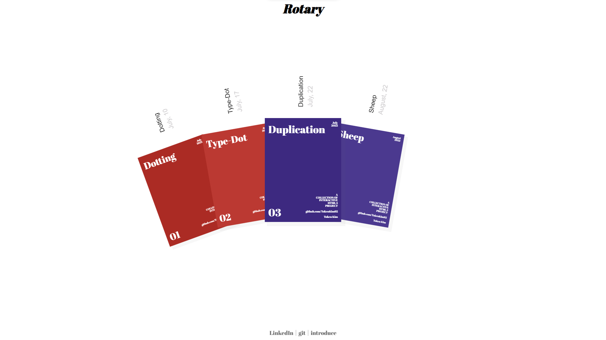

# Hi, I'm Token Kim

A C/C++ developer, looking to start a career as a full-stack web-developer
 

## Connect with me

- 

    <a href="https://www.linkedin.com/in/deokgeun-kim-9189ab247/" rel="nofollow noreferrer">
       LinkedIn </img>
    </a>
  

- :mailbox: TokenKim92@gmail.com
   

## My tech stack :books:

    
    

    
    
    
    

    

 

## Interactive HTML5 Portfolio

This project was implemented to show how a single page application (SPA) works with animation effects in HTML5. I use all my HTML5 projects as cover for each portfolio.

